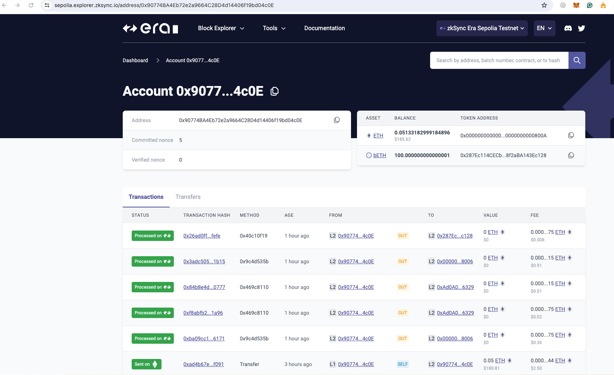
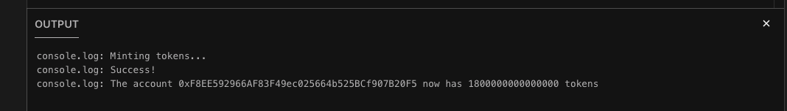

# BUILDH3R MATTERLABS WORKSHOP

## About
Overview: zkSync Era is a trustless protocol that uses cryptographic validity proofs to enable scalable and affordable Ethereum transactions. It is a Layer 2 ZK rollup. Processing and most data storage in the zkSync Era happen off-chain. Batch processing is done on transactions before a validity proof is generated. The same security guarantees as in the L1 are provided to customers because all validity proofs are verified on Ethereum. zkSync Era is intended to resemble Ethereum in appearance and functionality, but with faster throughput and lower prices. Similar to Ethereum smart contracts, these may be accessible using the same clients as other EVM-compatible chains and are written in Solidity/Vyper.

IDE : https://zksync.atlaszk.com/ide

Link to explorer: [https://sepolia.explorer.zksync.io/address/0x90774BA4Eb72e2a9664C28D4d14406f19bd04c0E](https://sepolia.explorer.zksync.io/address/0x90774BA4Eb72e2a9664C28D4d14406f19bd04c0E)
### Step 1 Deployed ZeekSecretMessage contract 🚀
#### Address: 0x287Ec114CECb05174769CAE0628f2aBA143Ec128

### Step 2 Deploted Test token contract 🚀
#### Address : 0xAd0A060661497b14Ede8898f7FBB4aFc6b516329

### Step 3 Minted token to address for new zeek message 🚀
 

### Step 4 use paymaster transactions to pay gas via generated token 
